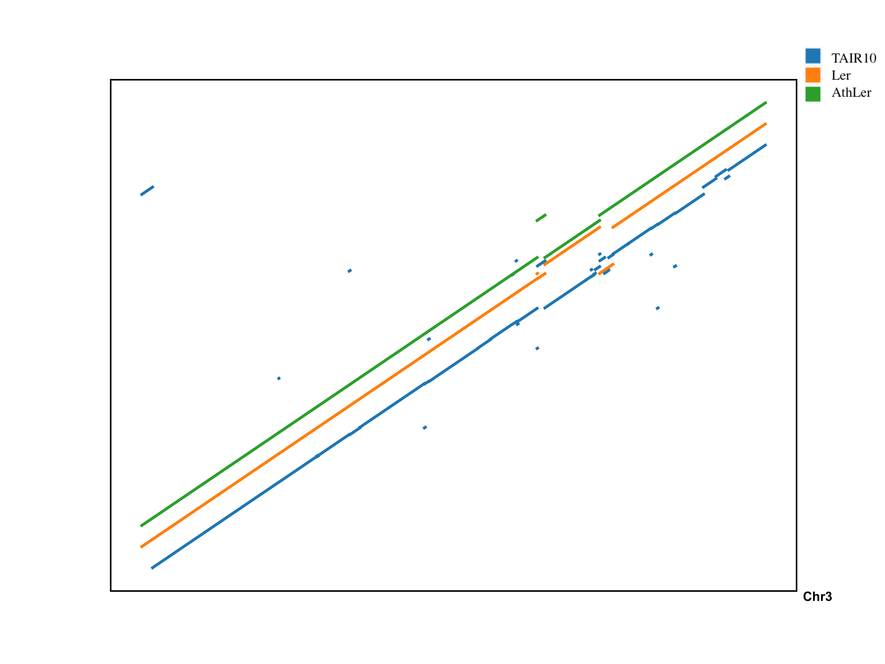

# Reference-agnostic Representation and Visualization of Pan-genomes
The pan-genome of a species is the union of the genes and non-coding sequences present in all individuals (cultivar, accessions,or strains) within that species. Due to the complex structural variations that can be observed when comparing multiple individuals of the same species, an effective and intuitive visualization of a pan-genome is challenging. 

PGV is reference-agnostic representation and visualization of pan-genomes. It is a novel representation method based on the notion of consensus ordering that enables an intuitive, effective and interactive visualization of a pan-genome. The utility of such representation is visualized on  a web-based pan-genome browser that can present complex structural genomic variations.

## Using PGV

### Installation
PGV dependencies are controlled by Conda (https://docs.conda.io/en/latest/)

Install from Conda:
```
# create isolated Conda runtime environment
conda create -n pgv-env
# activate the Conda environment
conda activate pgv-env
# Install PGV
conda install -c pgv-channel pgv
```

### Workflow

The input to PGV is a set of n individual genomes for the same species, or a set of genomes from very closely-related species. To obtain the best results, input genomes must have a similar level of contiguity. 

First, PGV carries out a genome-wide multiple sequence alignment on all the inputs using [progressiveMauve](http://darlinglab.org/mauve/user-guide/progressivemauve.html). The output of progressiveMauve is used to convert genome sequences into block orderings consisted of C/D/U blocks. C-block (core) corresponds to an alignment that contains all n individuals; D-block (dispensable) corresponds to an alignment which contains at least two individuals and at most n−1. U-block (unique), is a block that belongs exclusively to one individual genome. After the conversion of each genome into blocks, PGV computes the consensus ordering for the C-blocks, which will constitute the “back-bone” of the pan-genome. 

![pgv\[fig1\]](docs/figs/flowchart.png)

There are three different output formats of PGV:
  (i) dotplot comparing n genome orderings with consensus ordering
  (ii) [PGV Genome Viewer](http://pgv.cs.ucr.edu) for blocks with actual coordinates
  (iii) PGV Genome Viewer for blocks with gapped coordinates aligned with consensus


### Usage
[ProgressiveMauve](http://darlinglab.org/mauve/user-guide/progressivemauve.html) is used to generate multiple sequence alignments for all the genomes within the pan-genomes. 

Following input needs to be provided to run the PGV flow:
-    `XMFAFile` Output file of ProgressiveMauve (.xmfa)
-    `inputGenomes` Genome sequence files in pan-genomes 
-    `alnScoreThr` Threshold for alignment scores to determine potential misjoins
-    `BEDaligned` Whether to align core blocks in accession with corresponding core blocks in consensus
-    `color` Colors used for different blocks in PGV Genome Viewer [optional]
-    `numOfChrms` ProgressiveMauve concatenates all chromosomes/contigs of one genome into one long sequence. The value of numOfChrms allows our tool to “undo” the concatenation of all input sequences carried out by progressiveMauve, that is, it allows our tool to split chromosomes (or contigs or scaffolds) for the dotplot and BED files generation. 

If the user sets numOfChrms to a number smaller than the actual number of chromosomes, only the first numOfChrms chromosomes will be split for the dotplot and in the BED files. For instance if the user sets numOfChrms=2 when the number of chromosomes is 5, PGV will split the first two chromosomes and store their results as “chr1” and “chr2”. The sequence for chr3, chr4, and chr5 will stay concatenated together, and all the block orderings will be displayed as if they were one long sequence named “contig” in dotplot/bed files.

Even if numOfChrms is set “incorrectly”, all data included in input FASTA files will be processed by progressiveMauve and PGV to identify different types of blocks and their consensus ordering.

Run PGV pipeline as:
```
pgv -c config_file
```

Example:
To run PGV on Arabidopsis pan-genomes with 4Mb sequences on chromosome three for three different accessions

```
pgv -c /Users/PGV/pgv/sample/config

Finished processing multiple sequence alignments
Built consensus sucessfully
Generated output BED files. Please visit pgv.cs.ucr.edu to view these.
Generated dotplots between each assembly and consensus sequence
```
This will generate a dotplot comparing core blocks of each accession to consensus ordering. 


This will also generate three unaligned BED files for the input genomes to be viewed in PGV Genome Viewer. All blocks are at their actual coordinates along each genome. Here for block C9, it is at different locations at each genome.
![panviz\[fig3\]](docs/figs/arabidopsisPGVUnaligned.png)

If BED files are set to be aligned by `BEDaligned`, C-blocks will be gapped and aligned to their corresponding ordinates on consensus ordering. Here for the same block C9, it is at same locations for each genome as in consensus ordering.
![panviz\[fig4\]](docs/figs/arabidopsisPGVAligned.png)

### PGV Genome Viewer
The output BED files from above sample are also available under `sample/outputBED`. Upload such files to [PGV Genome Viewer](http://pgv.cs.ucr.edu) to have an interactive view of the above sample.

### Additional feature
`extract_seq_for_blocks.py` can be used to extract fasta sequence for specific block type (core, dispensable, unique). 
If users are interested in getting the genomic sequences of different block types for further investigation, by running as:

`python extract_seq_for_blocks.py -g my_genome_fasta_file -bed my_bed_file -block core -o my_output_fasta_file`

Please note that block type is only supported as one of {core, dispensable, unique}.
